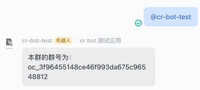

# ospp-cr-bot
开源之夏 - 一种通用的 Code Review 机器人

## How to Build

```bash
go mod tidy
go build ./cmd/main.go
```

## How to Run

```bash
./main
```

## How to Use

首先，请确保你已阅读过飞书开放平台文档并创建好你的应用。

参考：[https://open.feishu.cn/document/ukTMukTMukTM/uITNz4iM1MjLyUzM](https://open.feishu.cn/document/ukTMukTMukTM/uITNz4iM1MjLyUzM)

在项目根目录下创建 `.env` 文件，并填入如下内容：

```
LarkAppId=cli_a2f1d921fbxxxxxx
LarkAppSecret=Ss4kqZbQxhujO3BsIHcQZb3lDkxxxxxx
VerificationToken=6mLPrm022g3IrQcF8RUSLgVJ2txxxxxx
EncryptKey=xxx
```

程序会自动读取当前目录下的 `common.yaml` 文件。通常该文件的结构如下

```yaml
tasks:
  - name: "Task 1" // 名称
    repo: lyleshaw/go-best-practice // 仓库地址
    repoType: github // 仓库类型，可选值：github, gitlab
    recevier: oc_a0553eda9014c201e6969b478895c230 // 接收人的飞书 ID，如何获取见下
    recevierType: group // 接收人类型，可选值：group, user
    pushChannel: lark // 推送渠道，可选值：lark, slack
  - name: "Task 2"
    repo: xxx/xxx
```

请根据需求自定义上述参数。

## How to Get My Lark ID

请在启动服务后，拉入群聊并 @cr-bot-test，bot 会获取你的 Lark ID 并回复。


