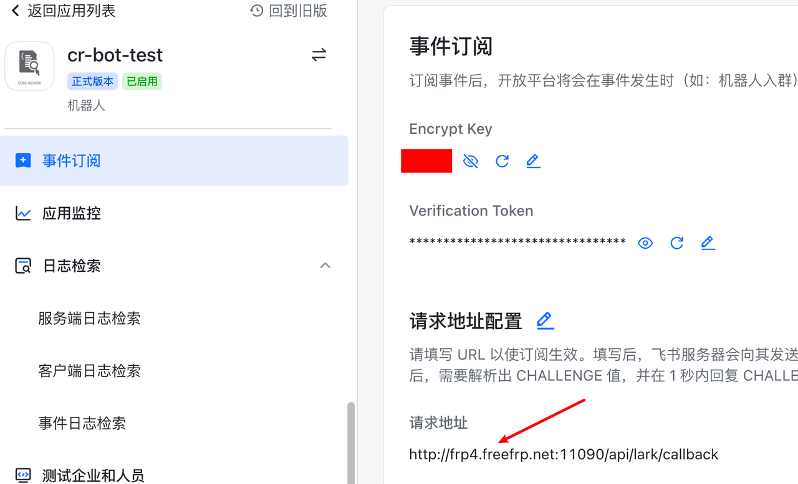

# ospp-cr-bot
开源之夏 - 一种通用的 Code Review 机器人

## 背景

Code Review 是软件研发协作中的重要⼀环，⼤家在代码提交后都需要等待 Reviewer 的 Review；同时当Reviewer 提交了“修改建议”后，PR/MR 的提交者还需要根据“修改建议”相 应更新⾃⼰的代码。在这个过程中可能代码提交者等了半天也没有⼈来 Review，或者 Reviewer 提交了“修改建议”后等了半天也没有看到提交者修改。所以各⽅及时收到“动作通知”，⾼效完成⾃⼰的“Review/Fix”⼯作是⾮常重要的。

## 目标

1. 通过 webhook 实现通过对 GitHub 的 PR/MR/Review/Comment 等事件的监听
2. 创建⻜书机器⼈应⽤，并调⽤ fastwego 的⻜书 SDK 实现对⻜书机器⼈发送消息函数 的封装
3. 设计配置⽂件格式，使项⽬可以优雅的读⼊⻜书号/群 与 Github/Gitlab Repo 之间 的映射关系
4. 实现对推送⼈的持续通知等需求
5. 通过 helm 完成部署

> Ref: https://summer-ospp.ac.cn/#/org/prodetail/22abc0185

## 方案

### 整体架构


### 业务流程时序图


## ShowCase


## 私有化指南

### 部署指南

1. 创建飞书应用

在飞书开放平台的开发中后台（https://open.feishu.cn/app）创建应用。


2. 项目启动配置


在应用根目录下创建 .env文件, 填入如上四个凭证：

```yaml
   LarkAppId=cli_xxx
   LarkAppSecret=xxx
   VerificationToken=xxx
   EncryptKey=xxx
```

在权限管理中为应用开通必要权限


在 事件订阅/应用功能-机器人 中分别填入接口 URL 做鉴权，URL 分别为：

```bash
http://domain:port/api/lark/cardCallback
http://domain:port/api/lark/callback
```




3. 获取群聊 ID 及用户 ID 并配置 yaml 文件

启动应用后，在需要订阅消息的群聊中@cr-bot，会收到以 @oc_ 开头的一串字符，此为该群聊群号，向 bot 发送私聊消息 ID 会收到以 @ou_ 开头的一串字符，此为该用户 ID


此时可参照 common.yaml.example 文件填写 bot 配置并创建 common.yaml 文件：
   
```yaml
tasks:
- name: "Task 1"
  repo: lyleshaw/repoTest // GitHub URL
  repoType: github // 仓库类型，可选 github 和 gitlab
  receiver: oc_xxxxxxxx // 该仓库指定的群聊
  pushChannel: lark // 推送渠道，可选 lark 和 slack
maps:
- name: "1"
  github: lyleshaw // github ID
  lark: ou_xxxxxx // 飞书用户 ID
  role: member // 角色
  boss: 0 // 上级的 GitHub 账号，若无则填 0
- name: "2"
  github: abc
  lark: ou_xxxxxx
  role: contributor
  boss: lyleshaw
scheduler:
  - timeUnread1: 30 // PR/Issue 消息第一次发送消息后若未读，经过 TimeUnread1 分钟后重发
  - timeUnread2: 30 // PR/Issue 消息第二次发送消息后若未读，经过 TimeUnread2 分钟后发送给上级
  - timeUnread3: 660 // PR/Issue 消息第三次发送消息后若未读，经过 TimeUnread3 分钟后抄送群聊
  - commentUnread: 60 // Comment 消息第一次发送后若未读，经过 CommentUnread 分钟后抄送群聊
```

修改完配置后，重启项目即可开始使用

### 修改指南

1. 修改升级逻辑

见 internal/pkg/eventListener/eventListener.go 文件及其注释

2. 修改推送内容
  
参考 https://open.feishu.cn/tool/cardbuilder?from=howtoguide 搭建消息卡片，并修改 internal/pkg/pushChannel/lark/messageTemplate 下的文件

## Check List
- [x] 主体功能
  - [x] 读取配置
  - [x] GitHub 消息接收
    - [x] PR
    - [x] Issue
    - [x] Comment
    - [x] Review
  - [x] 飞书消息卡片
    - [x] PR
    - [x] Issue
    - [x] Comment
    - [x] Review
  - [x] 消息升级
    - [x] PR/Issue 30 分钟后未读重复提醒
    - [x] PR/Issue 60 分钟后未读提醒上级
    - [x] PR/Issue 12 小时后未读抄送群聊
    - [x] Comment/Review 无@成员抄送群聊
    - [x] Comment/Review 有@成员提醒
    - [x] Comment/Review 有@成员 30 分钟后未读抄送群聊
  - [ ] Helm 部署
- [x] 测试
  - [x] PR/Issue 部分
  - [x] Comment/Review 部分
- [x] 代码优化
  - [x] Log 打点
  - [x] 细节
- [ ] 后续支持
  - [ ] Slack 支持
  - [ ] GitLab 支持
=======
## How to Build

```bash
go mod tidy
go build ./cmd/main.go
```

## How to Run

```bash
./main
```

## How to Use

首先，请确保你已阅读过飞书开放平台文档并创建好你的应用。

参考：[https://open.feishu.cn/document/ukTMukTMukTM/uITNz4iM1MjLyUzM](https://open.feishu.cn/document/ukTMukTMukTM/uITNz4iM1MjLyUzM)

在项目根目录下创建 `.env` 文件，并填入如下内容：

```
LarkAppId=cli_a2f1d921fbxxxxxx
LarkAppSecret=Ss4kqZbQxhujO3BsIHcQZb3lDkxxxxxx
VerificationToken=6mLPrm022g3IrQcF8RUSLgVJ2txxxxxx
EncryptKey=xxx
```

程序会自动读取当前目录下的 `common.yaml` 文件。通常该文件的结构如下

```yaml
tasks:
  - name: "Task 1" // 名称
    repo: lyleshaw/go-best-practice // 仓库地址
    repoType: github // 仓库类型，可选值：github, gitlab
    recevier: oc_a0553eda9014c201e6969b478895c230 // 接收人的飞书 ID，如何获取见下
    recevierType: group // 接收人类型，可选值：group, user
    pushChannel: lark // 推送渠道，可选值：lark, slack
  - name: "Task 2"
    repo: xxx/xxx
```

请根据需求自定义上述参数。

## How to Get My Lark ID

请在启动服务后，拉入群聊并 @cr-bot-test，bot 会获取你的 Lark ID 并回复。


